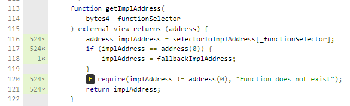

# AddressRelay.sol

## getImplAddress(bytes4 _functionSelector)

### Unneeded require statement
Type: Code optimization

This has no real impact, as it is a view function.

The require statement at the end of the function is not needed. Right before, the fallbackImplAddress is set if `implAddress == address(0)`, so `implAddress` will never be `address(0)` here. 

